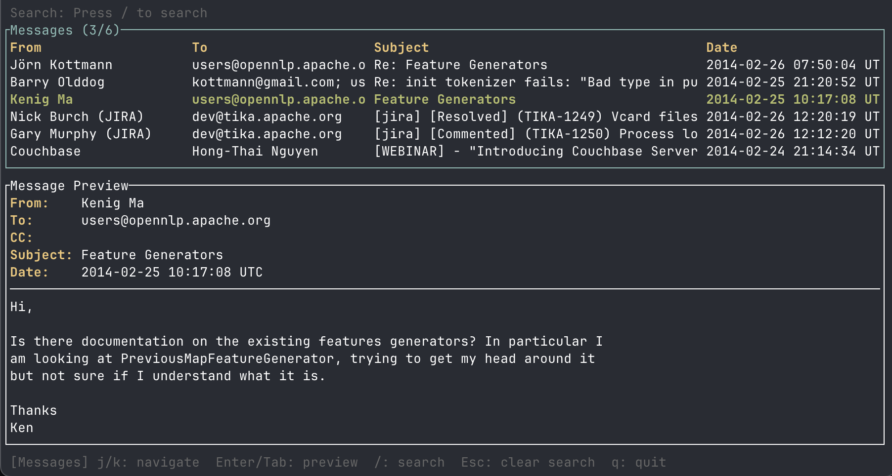

# pstexplorer

A CLI tool to explore and extract data from Outlook PST files.

## Installation

Check the instructions on the latest [release page](https://github.com/stchris/pstexplorer/releases).

## Usage

```
pstexplorer <COMMAND>

Commands:
  list    List all emails in a PST file
  search  Search emails in a PST file by query string (matches from, to, cc, body)
  browse  Browse PST file contents in a TUI
  stats   Print statistics about a PST file
  export  Export a PST file to a SQLite database
```

## Features

### stats

Print a summary of the PST file: folder count, email/calendar/contact/task/note counts, attachment count, and date range.

```
PST Statistics: "testdata/testPST.pst"
  Folders:          2
  Total items:      6
  Emails:           6
  Attachments:      0
  Earliest message: 2014-02-24 21:14:34 UTC
  Latest message:   2014-02-26 12:20:19 UTC
```

### list

List all emails with subject, sender, recipient, and date. Supports `--format csv|tsv|json` for structured output and `--limit` to cap the number of entries.

### search

Case-insensitive full-text search across from, to, cc, and body fields. Supports the same `--format` options as `list`.

```bash
$ pstexplorer search --format json -- testdata/testPST.pst "tika"
[
  {
    "folder": "Début du fichier de données Outlook",
    "subject": "\u0001\u0001[jira] [Resolved] (TIKA-1249) Vcard files detection",
    "from": "Nick Burch (JIRA)",
    "to": "dev@tika.apache.org",
    "cc": "",
    "date": "2014-02-26 12:20:25 UTC"
  },
  {
    "folder": "Début du fichier de données Outlook",
    "subject": "\u0001\u0001[jira] [Commented] (TIKA-1250) Process loops infintely processing a CHM file",
    "from": "Gary Murphy (JIRA)",
    "to": "dev@tika.apache.org",
    "cc": "",
    "date": "2014-02-26 12:12:25 UTC"
  }
]
```

### export

Export folders and messages to a SQLite database for further analysis. Use `--output` to set the database path and `--limit` to cap the number of exported messages. 

> [!TIP]
> export to a SQLite db and then use `uvx datasette` to visually browse the data


### browse

Interactive terminal UI for navigating folders and reading messages.



# Datasette plugin

The `plugins/` folder includes a [Datasette](https://datasette.io/) plugin which makes browsing emails a bit easier, by providing detail views with next/prev buttons and a layout which separates header data. 

After exporting an SQLite db with `pstexplorer export my.pst` run:

```
uvx datasette serve my.db --plugins-dir plugins/
```

Run the playwright-driven integration test for this datasette plugin with:

```
uv run --with datasette --with pytest --with pytest-playwright pytest
```