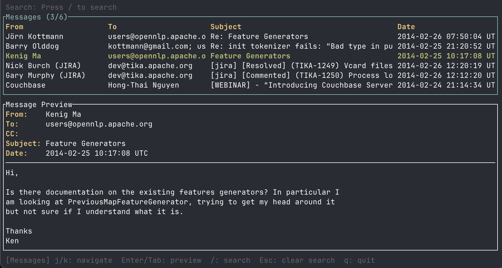
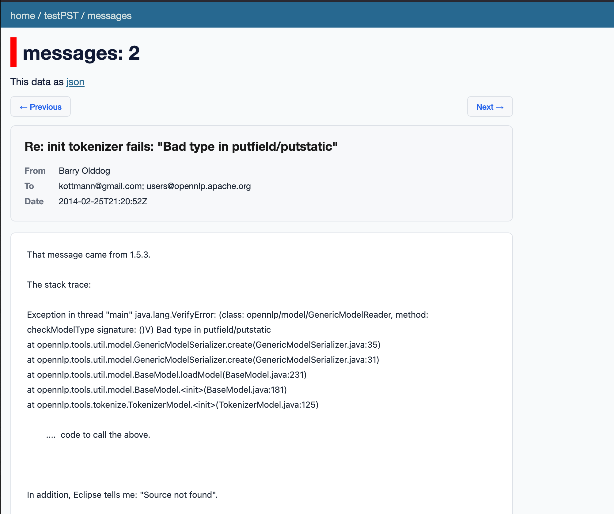

# pstexplorer

A CLI tool to explore and extract data from Outlook PST files.

## Installation

Check the instructions on the latest [release page](https://github.com/stchris/pstexplorer/releases).

## Usage

```
pstexplorer <COMMAND>

Commands:
  list    List all emails in a PST file
  search  Search emails in a PST file by query string (matches from, to, cc, body)
  browse  Browse PST file contents in a TUI
  stats   Print statistics about a PST file
  export  Export a PST file to a SQLite database
  llm     LLM-powered commands (embed emails, ask questions)
```

## Features

### stats

Print a summary of the PST file: folder count, email/calendar/contact/task/note counts, attachment count, and date range.

```
PST Statistics: "testdata/testPST.pst"
  Folders:          2
  Total items:      6
  Emails:           6
  Attachments:      0
  Earliest message: 2014-02-24 21:14:34 UTC
  Latest message:   2014-02-26 12:20:19 UTC
```

### list

List all emails with subject, sender, recipient, and date. Supports `--format csv|tsv|json` for structured output and `--limit` to cap the number of entries.

### search

Case-insensitive full-text search across from, to, cc, and body fields. Supports the same `--format` options as `list`.

```bash
$ pstexplorer search --format json -- testdata/testPST.pst "tika"
[
  {
    "folder": "Début du fichier de données Outlook",
    "subject": "\u0001\u0001[jira] [Resolved] (TIKA-1249) Vcard files detection",
    "from": "Nick Burch (JIRA)",
    "to": "dev@tika.apache.org",
    "cc": "",
    "date": "2014-02-26 12:20:25 UTC"
  },
  {
    "folder": "Début du fichier de données Outlook",
    "subject": "\u0001\u0001[jira] [Commented] (TIKA-1250) Process loops infintely processing a CHM file",
    "from": "Gary Murphy (JIRA)",
    "to": "dev@tika.apache.org",
    "cc": "",
    "date": "2014-02-26 12:12:25 UTC"
  }
]
```

### export

Export folders and messages to a SQLite database for further analysis. Use `--output` to set the database path and `--limit` to cap the number of exported messages. 

> [!TIP]
> export to a SQLite db and then use `uvx datasette` to visually browse the data


### browse

Interactive terminal UI for navigating folders and reading messages.



### llm embed

Index emails into a [ChromaDB](https://www.trychroma.com/) vector database. Embeddings are generated via any OpenAI-compatible API — locally with [Ollama](https://ollama.com/) or remotely with OpenAI.

The collection name defaults to the PST filename stem (e.g. `testPST.pst` → `testPST`).

```bash
# with Ollama
pstexplorer llm embed testPST.pst \
  --embedding-url http://localhost:11434/v1 \
  --embedding-model nomic-embed-text

# with OpenAI
pstexplorer llm embed testPST.pst \
  --embedding-url https://api.openai.com/v1 \
  --embedding-key sk-... \
  --embedding-model text-embedding-3-small
```

### llm ask

Ask a natural language question about your emails. Relevant messages are retrieved from ChromaDB and passed as context to a chat model.

> [!IMPORTANT]
> The `--embedding-model` must match the model used during `llm embed`.

```bash
# with Ollama
pstexplorer llm ask --collection testPST \
  --embedding-url http://localhost:11434/v1 \
  --embedding-model nomic-embed-text \
  --llm-url http://localhost:11434/v1 \
  --llm-model llama3.2 \
  "who sent me invoices last year?"

# with OpenAI
pstexplorer llm ask --collection testPST \
  --embedding-url https://api.openai.com/v1 \
  --embedding-model text-embedding-3-small \
  --llm-url https://api.openai.com/v1 \
  --llm-model gpt-4o-mini \
  "summarise the thread about the budget"
```

API keys can also be set via environment variables to keep them out of shell history:

```bash
export EMBEDDING_API_KEY=sk-...
export LLM_API_KEY=sk-...
```

Use `--n-results` (default: 5) to control how many emails are retrieved as context.

### Alternative: llmquery/query.py

`llmquery/query.py` is a standalone script that does the same RAG query using the Python `chromadb` and `ollama` libraries directly. It requires a locally running Ollama instance and is self-contained with inline dependency metadata — only `uv` is needed.

```bash
./llmquery/query.py "who sent me invoices in 2023?"
./llmquery/query.py --collection testPST "what is the date and time of the oldest email?"
./llmquery/query.py --collection testPST --n-results 10 "which emails contain source code?"
```

# Datasette plugin

The `plugins/` folder includes a [Datasette](https://datasette.io/) plugin which makes browsing emails a bit easier, by providing detail views with next/prev buttons and a layout which separates header data. 

After exporting an SQLite db with `pstexplorer export my.pst` run:

```
uvx datasette serve my.db --plugins-dir plugins/
```

Run the playwright-driven integration test for this datasette plugin with:

```
uv run --with datasette --with pytest --with pytest-playwright pytest
```

